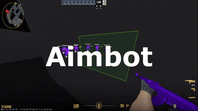
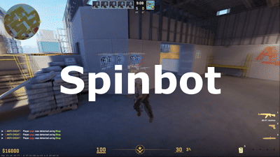
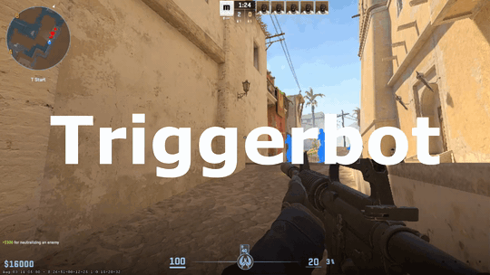

<div align="center">


  
# CS2-Anticheat-Defense

An advanced server-side anti-cheat plugin for Counter-Strike 2, developed using Metamod / SwiftlyS2.

</div>

<p align="center">
  <a href="https://discord.gg/d5uvMmUpuE">
    
  </a>
</p>

<div align="center">

[](https://buymeacoffee.com/cs4fun)

</div>

ACD is designed to detect both blatant rage cheats and advanced closet cheats through layered behavioral analysis, real-time monitoring and engine-level detection systems. Instead of relying on simple pattern checks or signature-based scans alone, ACD continuously analyzes player behavior, command input, aiming consistency, movement anomalies and engine interaction patterns to identify suspicious activity with high accuracy.

<table>
<tr>
<td width="50%" align="center">
<br>
<strong>Aimbot</strong>
</td>
<td width="50%" align="center">
<br>
<strong>Spinbot</strong>
</td>
</tr>
<tr>
<td width="50%" align="center">
<br>
<strong>Bhop</strong>
</td>
<td width="50%" align="center">
<br>
<strong>Triggerbot</strong>
</td>
</tr>
</table>


> [!IMPORTANT]
>The system combines multiple independent detection layers. This allows ACD to detect everything from aggressive spinbots and aimbots to subtle aim assistance, silent aim manipulation, anti-aim exploits, bhop scripting and nickname manipulation techniques.

---


## Requirements

[](https://www.sourcemm.net)

OR

SwiftlyS2

---

> [!NOTE]
> The detection architecture is built around evidence accumulation and long-term behavioral analysis rather than relying on a single suspicious action for instant detection. This approach allows the anticheat to identify advanced closet cheaters attempting to conceal their assistance through humanized settings, smoothing, randomized behavior, or subtle aim correction techniques.

---

## Features

### Aimbot Detection
Detects flick speed, angular velocity, crosshair snapping, target locking and triggerbot behavior.

### Aim Pattern Analysis
Tracks aiming consistency, reaction timing, accuracy anomalies and unnatural aim corrections over time.

### Silent Aim & Instant Flick Detection
Detects unrealistic instant transitions, impossible flick consistency and suspicious shot manipulation behavior.

### Anti-Aim & Spinbot Detection
Monitors abnormal view-angle + body movement behavior, fake angles and rapid spinning.

### Aim Assist Detection
Identifies subtle aim assistance, smoothing behavior, micro-corrections and hidden assistance scripts.

### Movement Exploit Detection
Detects bunnyhop scripts, macro strafing, movement manipulation and unnatural acceleration patterns.

### No-Spread & Rapid Fire Detection
Identifies weapon spread manipulation, unrealistic firing consistency and rapid weapon action abuse.

### Spam & Abuse Prevention
Protects against chat spam, radio spam, command abuse and disruptive player behavior.

### Discord Webhook Integration
Sends detailed detection logs, player statistics and evidence reports directly to your moderation Discord server.

---


In addition to gameplay analysis, ACD includes anti-exploit and server-protection components designed to detect malicious client behavior, spam abuse, suspicious engine interactions, and other non-standard gameplay modifications. The system is actively maintained and continuously adapted for modern CS2 engine changes, ensuring compatibility with evolving cheat techniques and networking behavior.

> [!TIP]
> ACD focuses on optimized performance, configurable action systems, detailed logging, and optional Discord/webhook integrations for real-time server administration and evidence tracking.


## Detection Comparison

```text
┌──────────────────────┬────────────────────────┐
│  Other Anti-Cheats   │          ACD           │
├──────────────────────┼────────────────────────┤
│ Mostly Event Driven  │ Layered Detection      │
│ Basic Heuristics     │ Real-Time Analysis     │
│ Partial Tracking     │ Deep Behavior Tracking │
│ Easily Bypassed      │ Multi-Layer Security   │
├──────────────────────┼────────────────────────┤
│ Reactive Systems     │ Active Monitoring      │
│ Moderate Response    │ Fast Detection Engine  │
│ Simple Validation    │ Adaptive Analysis      │
│ Short-Term Checks    │ Long-Term Analysis     │
└──────────────────────┴────────────────────────┘
```

## How ACD Works

ACD is designed to monitor player behavior as a whole rather than relying on a single detection method. Instead of looking only for known cheat files or obvious violations, the system analyzes gameplay patterns, player actions, and in-game behavior in real time.

Unlike traditional anti-cheat systems that often rely heavily on isolated triggers or basic event checks, ACD continuously evaluates player behavior over time. Suspicious actions are not treated as immediate proof on their own. Instead, the system accumulates evidence across multiple gameplay situations and detection layers before determining whether a player is behaving unnaturally.

ACD also operates using real-time engine-level monitoring, allowing it to analyze gameplay directly from low-level game events and command processing. This provides deeper visibility into player behavior and allows the system to react more effectively to abnormal actions, unnatural precision, impossible consistency, and other indicators commonly associated with cheating software.

Because multiple systems are always working together in parallel, bypassing one detection layer does not prevent the rest of the system from continuing to analyze player behavior. This layered approach makes advanced cheat bypassing significantly more difficult and unreliable compared to traditional event-based anti-cheat plugins.

## FAQ

<details>
<summary><strong>Is ACD tested against real free and paid cheats?</strong></summary>

Yes, ACD is tested against the most used free and paid cheats over net.

</details>

<details>
<summary><strong>Can it be used in Premier or Matchmaking?</strong></summary>

No, ACD is designed exclusively for community servers. It cannot be used in official CS2 matchmaking or Premier.

</details>

<details>
<summary><strong>Is ACD configurable?</strong></summary>

Yes. You can easily enable, disable or adjust the sensitivity of every detection module to fit your server's needs.

</details>

<details>
<summary><strong>What admin systems are supported by ACD?</strong></summary>

ACD supports all admin systems, even those built on different frameworks. All cheater bans are processed directly through your existing admin system.

</details>

<details>
<summary><strong>Can it detect every cheat?</strong></summary>

No anti-cheat can detect everything. ACD analyzes whether player behavior is too unrealistic to be legitimate. It can't catch every cheat, but catching most of them is still far better than having no protection.

</details>

<details>
<summary><strong>Does it support FFA?</strong></summary>

Yes, if `mp_teammates_are_enemies` is enabled, ACD automatically treats all players as enemies, matching the game's rules.

</details>

The overall goal of ACD is to maintain competitive integrity by identifying unfair gameplay advantages while remaining adaptive to modern cheat techniques and evolving CS2 engine behavior.

## ACD Official Discord
<a href="https://discord.gg/d5uvMmUpuE"></a>


